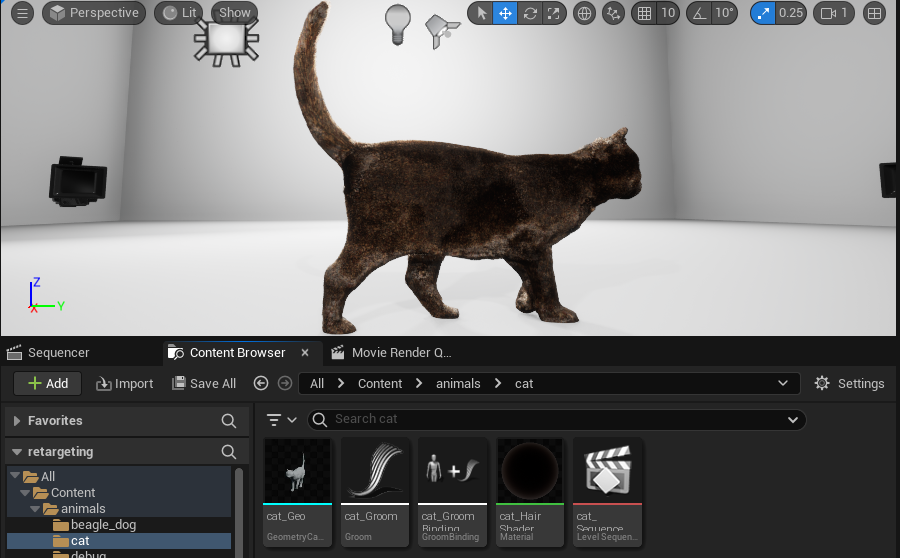

# 2. Import into Unreal Engine

Imports the `.abc` files from [step 1](01-process.md) into Unreal Engine 5.4+ and builds render-ready assets: Geometry Cache, Groom, Groom Binding, materials, and a Level Sequence per animal.

## Prerequisites

**Plugins** (Edit → Plugins, restart the editor after enabling):

- Python Editor Script Plugin
- Groom
- Alembic Groom Importer

**Project assets (optional)** : this repo ships **no** Unreal assets (`.uasset`/`.umap`). The import script can optionally use assets from **your own project**; set the paths in the `CONFIG` block at the top of `src/unreal/ue_import.py`:

| Asset | Config | Purpose |
|---|---|---|
| Hair material | `SOURCE_MATERIAL_CANDIDATES` | Duplicated per animal and assigned to the groom |
| Body material | `BODY_MATERIAL_PATH` | Assigned to the body geometry cache |
| Template map | `TEMPLATE_MAP_CANDIDATES` | Map with lighting/backdrop, loaded before import |

If an asset is missing, the script logs a warning and continues: the animal is imported with default materials into the currently open map. For hair, any material with its *Shading Model* set to **Hair** works as a starting point.

## Run (automated)

Open the Unreal project, then in the **Output Log** (switch the input mode to *Cmd*) run:

```
py "<path-to-this-repo>/src/unreal/ue_import.py" --groom "<data_dir>/<animal>/fur.abc" --geo "<data_dir>/<animal>/furless.abc"
```

- `--groom` : the strands `.abc` from step 1
- `--geo` : the body `.abc` from step 1
- `--name` : optional animal name, used as the asset prefix and the `/Game/animals/<name>` folder. Defaults to the two file names combined: `<groom filename>__<geo filename>` (e.g. `fur__furless`)

The script:

1. Imports the geometry `.abc` as a **Geometry Cache** (`<animal>_Geo`).
2. Imports the strands `.abc` as a **Groom** (`<animal>_Groom`).
3. Duplicates the hair material to `<animal>_HairShader` and assigns it to the groom.
4. Creates a **Groom Binding** of type *Geometry Cache* (`<animal>_GroomBinding`).
5. Creates a one-frame **Level Sequence** (`<animal>_Sequence`) with the geometry cache and groom as spawnables, the groom attached to the geometry.
6. Applies the groom strand settings from `GROOM_SETTINGS` (see below).

Resulting assets, under `/Game/animals/`:

```
/Game/animals/<animal>/
├── <animal>_Geo             (Geometry Cache)
├── <animal>_Groom           (Groom)
├── <animal>_GroomBinding    (Groom Binding)
├── <animal>_HairShader      (Material)
└── <animal>_Sequence        (Level Sequence)
```



Both conversions from the Blender/NeuralFur coordinate system to Unreal use **Scale = (100, −100, 100)** and **Rotation = (90, 0, 0)** : meters → centimeters plus an axis flip. If the groom and the body do not overlap in the viewport, these settings are the first thing to check.

## Groom settings

The `GROOM_SETTINGS` dict at the top of `ue_import.py` controls the strand configuration:

| Setting | Default |
|---|---|
| `hair_width` | 0.05 |
| `hair_shadow_density` | 0.8 |
| `use_rt_geometry` | **False** |
| `voxelize` | True |
| `use_stable_rasterization` | True |

You can also change them manually per groom: double-click the groom asset → *Strands* tab.

## Manual import (single asset)

If you prefer to import by hand instead of running the script:

**Geometry**: drag the geometry `.abc` into the Content Browser. In the *Alembic Cache Import Options*:
- Import Type: **Geometry Cache** (the dropdown defaults to *Static Mesh*; change it)
- Scale: **(100, −100, 100)**, Rotation: **(90, 0, 0)**

**Groom**: drag the strands `.abc` into the Content Browser (it is detected as a groom automatically). Then double-click the groom asset and in the *Strands* tab set **Hair Width** to 0.02–0.05.

**Binding**: right-click the groom asset → **Create Binding**:
- Groom Binding Type: **Geometry Cache**
- Target Geometry Cache: the imported geometry cache
- Click **Create**

**Scene**: drag the Geometry Cache and the Groom into the level. Select the Groom actor and set its **Binding Asset** to the binding you created. In the Outliner, drag the GroomActor onto the GeometryCacheActor to parent it. If groom and body do not overlap, re-check the Scale/Rotation import settings.

Next step: [3. Animate](03-animate.md)
